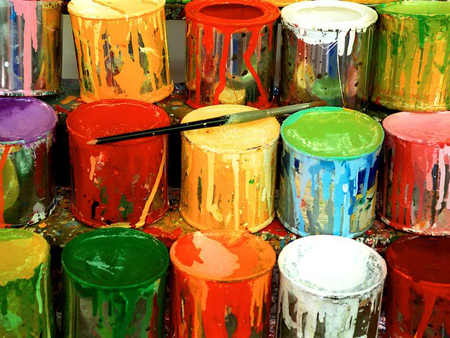

Art is a big part of my life, creating work that never existed before, the long hours dedicated in the process.  I see art as a puzzle that needs a solution.  When I'm making one of my pieces I am consumed by it.  The creative process takes over every second of my day. Even when I'm not physically painting or drawing, my mind is trying to solve the problem of "What do I do next?", "How can I make it better?"  Then one day I took an ICS course.

The first Computer Science course I took was ICS 111 with Jason Leigh.  In the beginning I found the class to be like any other science class where I had to memorize chapters in a book and regurgitate the answers for some sort of quiz or test, but then we had our first programming project.  I had to create an interactive musical application.  That's when it clicked in my head that writing code uses the exact same process as when I'm painting or drawing.  I started to then spend more time thinking about why a certain portion of my code wasn't working than how to finish an art piece.

Presently I am working on my Bachelor's in Information and Computer Science at the University of Hawaii, Manoa.  I hope to sharpen my skills in various languages so I can continue to create fun applications I can be proud of.  Also, I'm interested in learning about web development and database management so I could make beautiful websites that are very functional and relevant.

