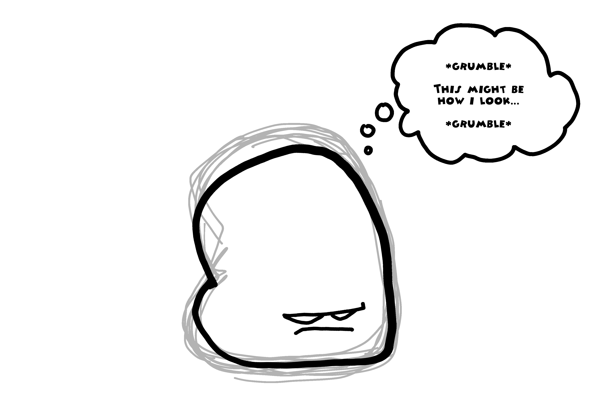
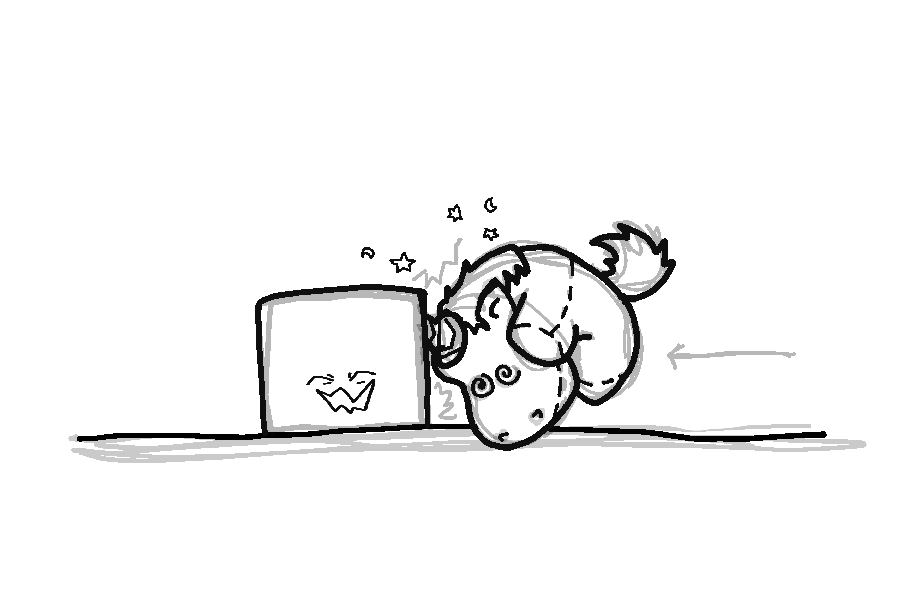
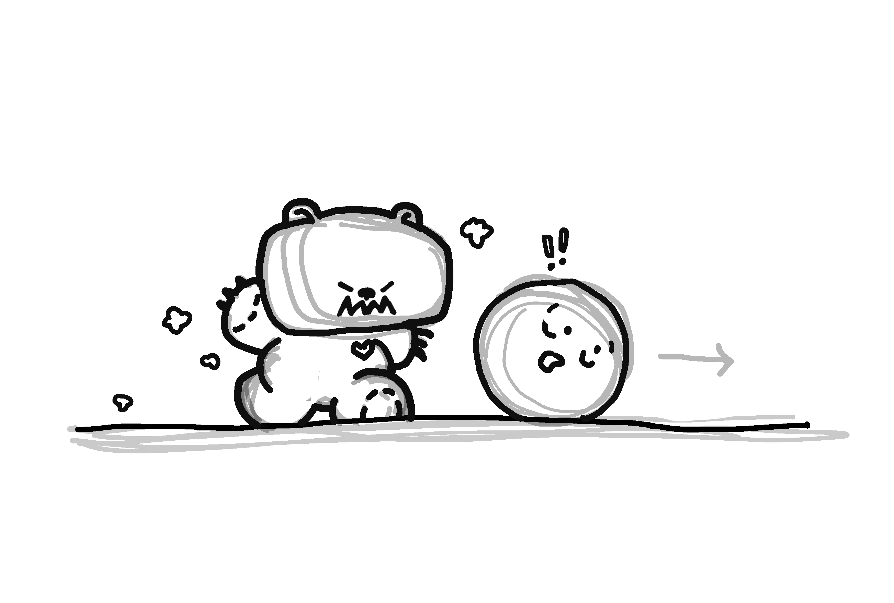
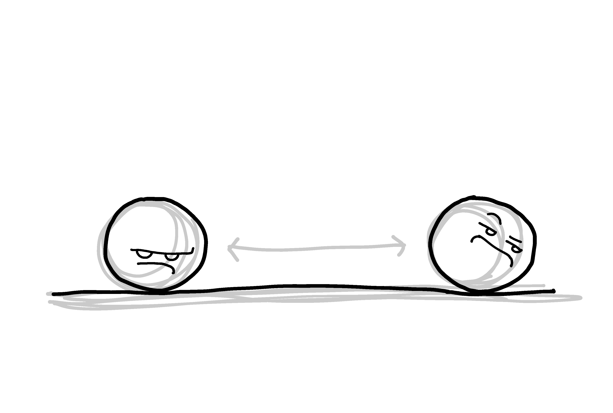
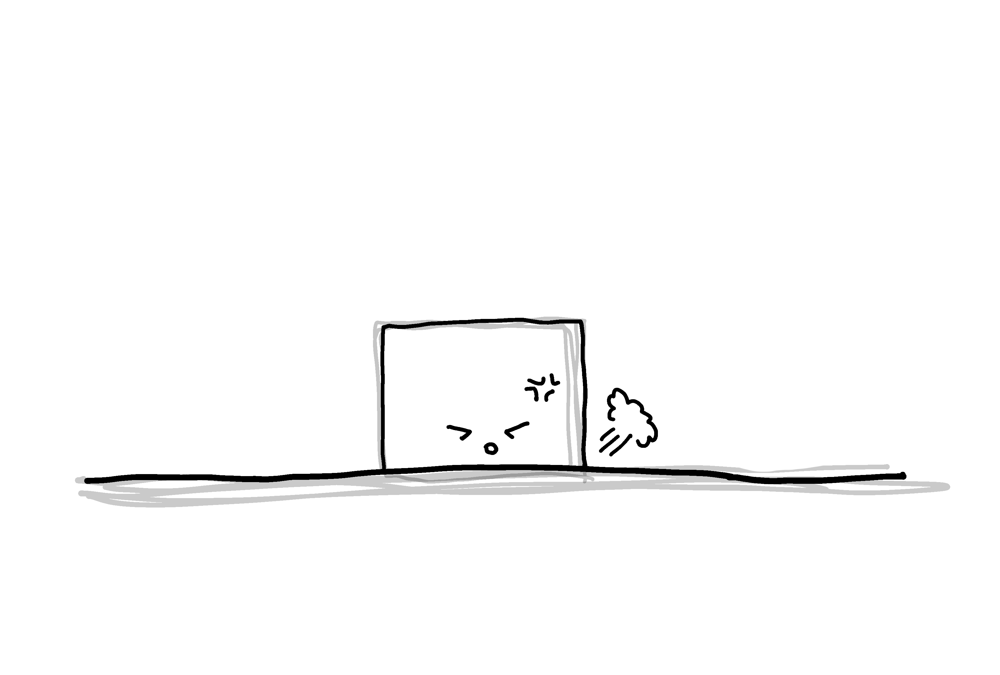
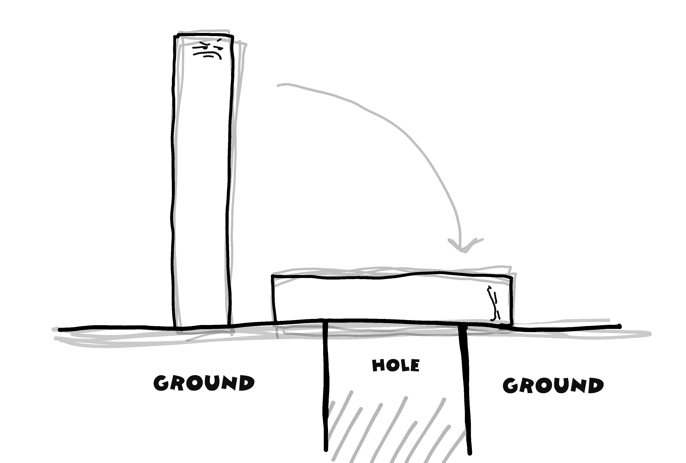

A 2D problem-solving / platformer game centered around a grumpy lump of "play dough" who wants to be happy. The play dough can shift into three different shapes: a ball that's able to roll side to side, an invulnerable block that concentrates his mass so he can drop down, and a longer stick shape that lets the play dough climb up to higher platforms or form bridges across gaps.

 
The game will start with a brief animation of a girl playing with several jars of brightly colored play dough. She smushes and molds all the play dough together until the colors blend into one grumpy lumpy blob of gray, at which point she throws it aside in favor of her other toys.
 
The gameplay begins when in his quest for happiness the play dough crashes the first of several pretend parties full of unicorns or teddy bears and things. He has to solve puzzles, navigate around obstacles and beat up cute things if he has to. There may be a couple of mini bosses leading up to a big boss battle in the last stage. Throughout the game, the play dough may be able to power up or change himself by absorbing things lying around- cupcake sprinkles, crayons to change colors, ribbons that make him striped, stardust to make him glow in the dark, etc. and possibly a few other power-ups. I'm also trying to figure out some kind of level/ skills system.

<h2>Team Members</h2>
<ul>
	<li>Neil Teves - ICS lead</li>
	<li>Kayla Abalos - ACM lead</li>
</ul>

<h2>Concept Art:</h2>

  
  
  
  
  

