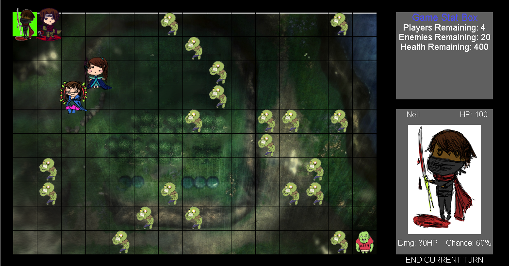
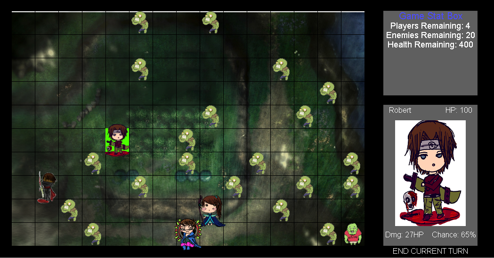
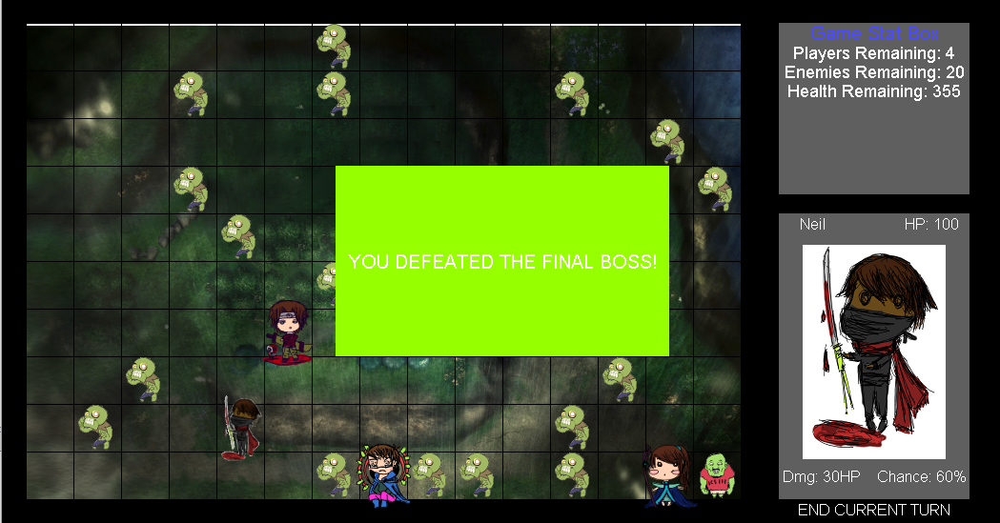

  
  
  

Zuzzle is a turn-based videogame where you have four main characters and are suppose to kill a boss zombie before your characters are all dead.  Between your four characters and the boss zombie are many regular zombies.  Your four characters each have different stats that are comprised of; health points, attack, defense, and chance to hit percentage.  The regular zombies have similar stats as well but they are much weaker.  At the start of the game your characters will spawn in the designated start area of the map and then the zombies will randomly populate the other areas of the map.  The map is grid-based like a chessboard.  Your characters can move, at most, two blocks away and zombies can only move one.

The project was the final project for my ICS 111 class.  I was responsible for integrating the visuals with the code.  I had to make sure that the characters and zombies spawned in their designated areas, with their designated images.  Also, I had to make sure when the characters, or zombies, moved that their image/sprites moved with them.
