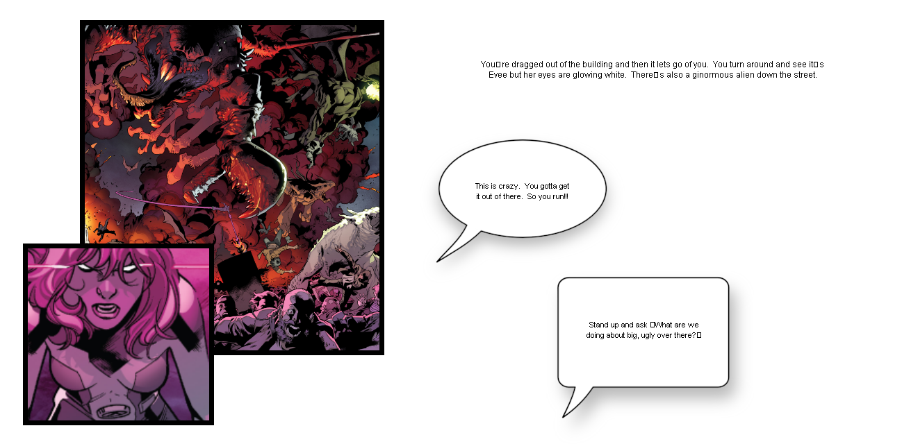
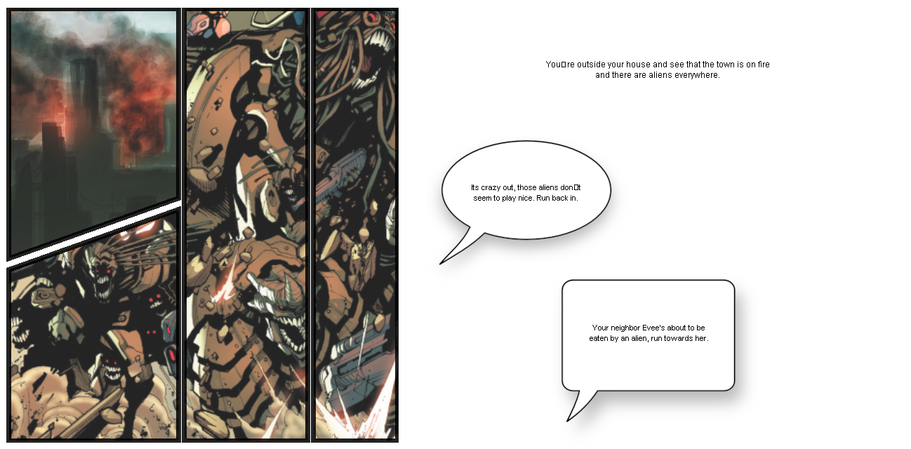
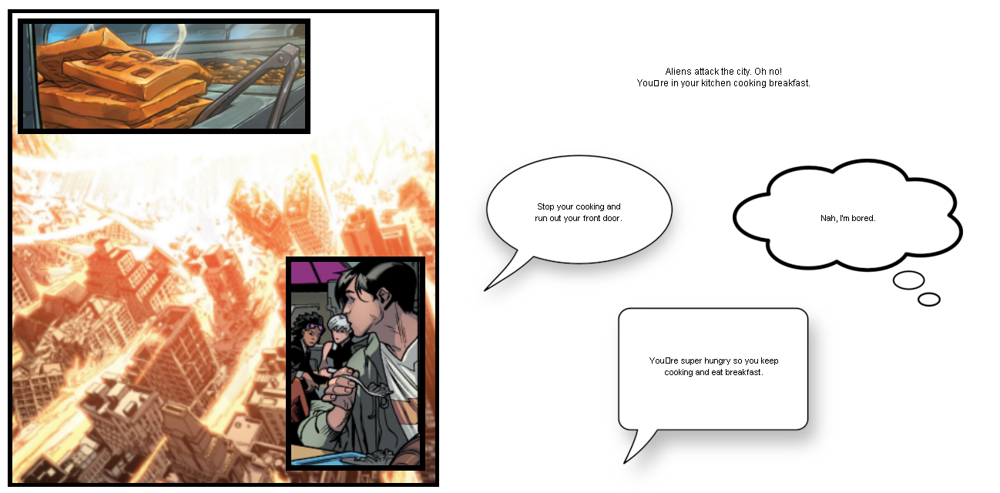

My team created this choose-your-own-adventure style web comic in ICS 111.  Users can experience different stories by what speech bubble they choose in each page of the application.

  
  

My main responsibility during this project had been implementing the overall code.  I had to write the code to parse text from the script and have it load into their designated comic pages.  I had to ensure that the speech bubble links sent users to the correct comic page when clicked.  I had to create the GUI for the program.  All images were borrowed from [Marvel](http://marvel.com) comics.
