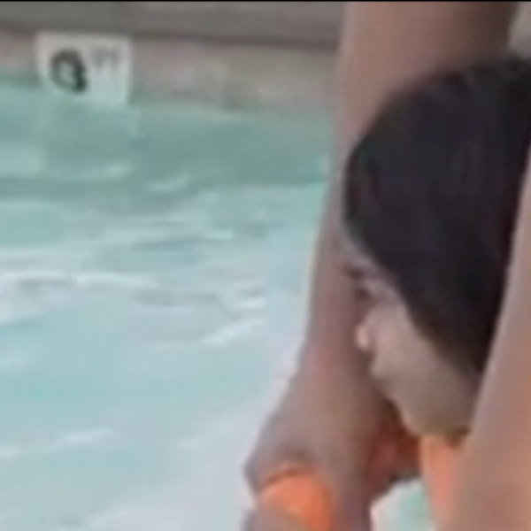

I had two intentions for creating my work.  First I wanted to write about my daughter and certain things in her life.  I chose to write aspects in her life that seemed trivial, none of the more memorable moments like birthdays or first words.  I wanted these smaller moments because I wanted emphasize the importance of them.  I find them to be more important because they happen much more often than a first day at school or first bike ride.  These little things, to me, are the foundations to my happy family.  My second intention is to write about the imagination.  Most of my work was about my daughter’s imagination but for my long essay I wrote down about my own imagination.

The way I tried to show how these little moments are important in my work was by using the imagination.  I tried to write about an event that happened frequently, for example, going to the pool and my daughter cautiously investigating the water before she jumps in, and then creating an awesome out of this world scene out of it through the use of the imagination.  Through this method I tried to make something small into something big.
