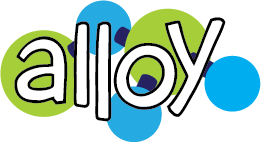
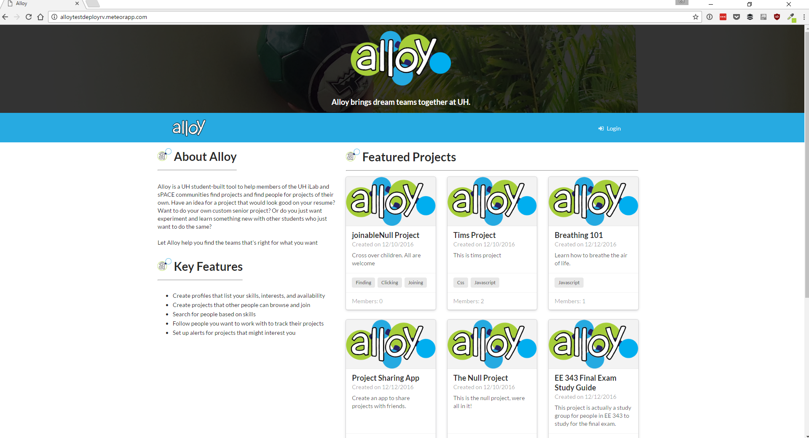
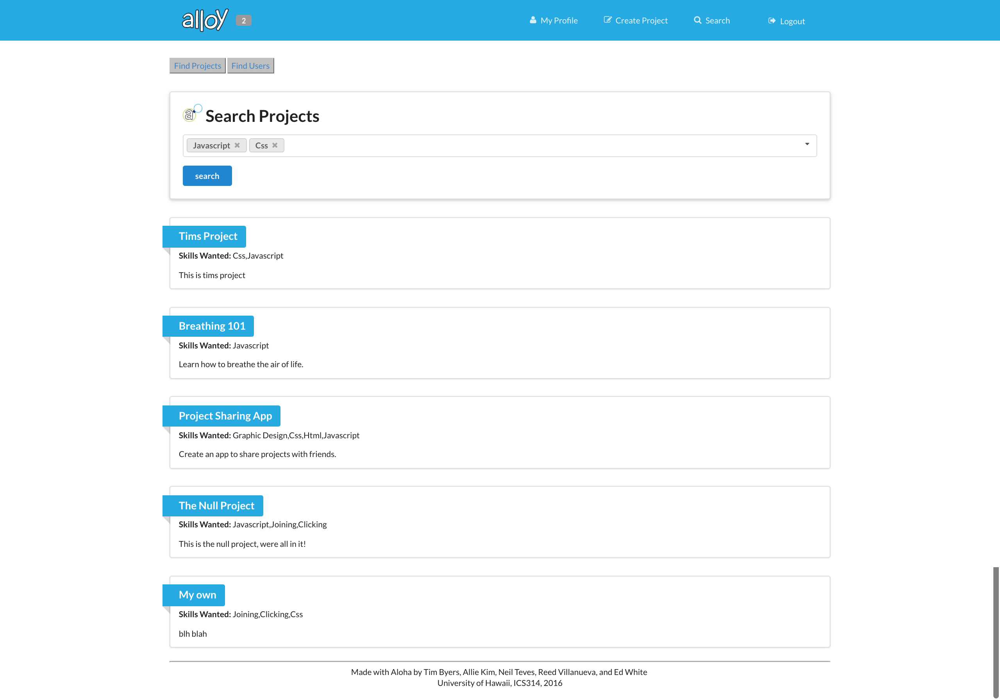

Alloy is a web application built for the University of Hawaii: Manoa students.  The application is almost like a social media site where users are able to sign in with their UH Manoa logon and interact with other users.  The main goal of Alloy is to create a space that lets students share projects they are working on and find other students who want to work on their projects.  Another goal Alloy hopes to achieve is to connect students of different departments together.  To break down the walls that separate these different ideas and meld them together so, through Alloy, something new and profound can be created from many different collaborators with varying knowledge and skills.

My responsibilities during the creation of Alloy mainly consisted of coding the search function.  It was a bit difficult at first because my understanding of Meteor and MongoDB were very limited.  It took me sometime to get a grip of the new language, although that grip was still very minimal.  The search function is created reactively, meaning that the website does not have to change webpages when a search query is entered.  All actions happen within the same webpage.  It's a nice feature to keep the code clean, less pages means less code to keep track of in the program.  The search function is also equipped with an autofill capability that pulls from a collection of entered projects skills, associated attributes that are related to a project.

 

